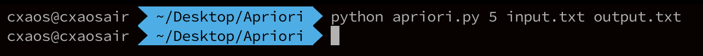
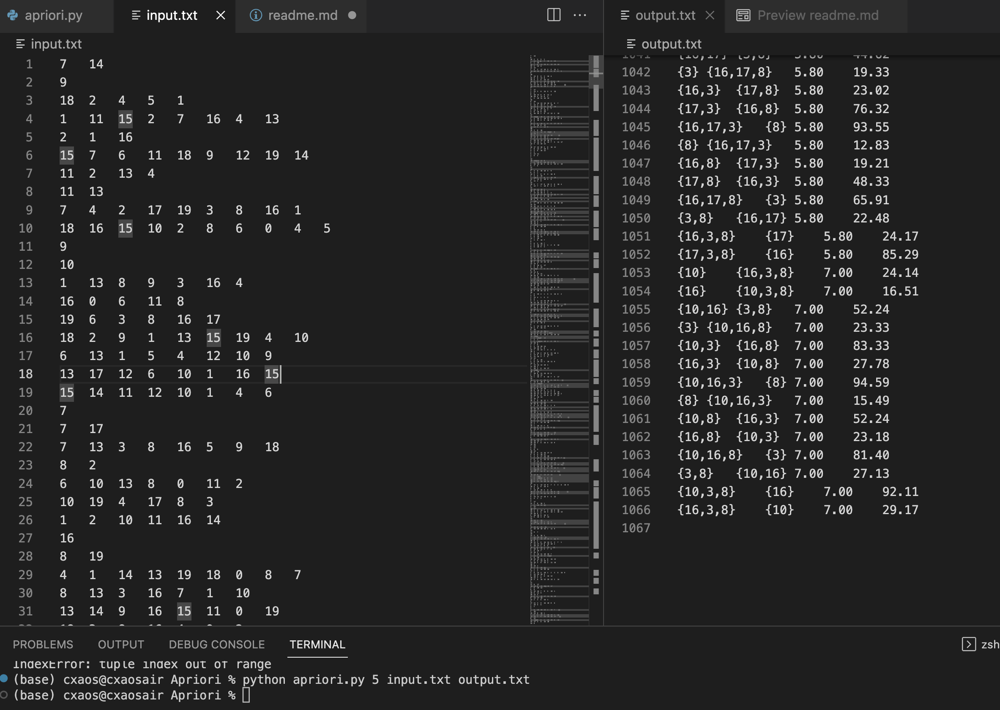

# **Assignment #1**
## Apriori algorithm implementation
컴퓨터소프트웨어학부 2019055078 신채영
***
## **Apriori Algorithm**
Apriori 알고리즘은 데이터 마이닝 분야에서 사용되는 알고리즘으로 빈번하게 발생하는 항목 집합을 찾아내는 데 사용된다.
### - Support(지지도)
- 전체 거래 중 항목 집합이 포함된 거래의 비율
- Minimum Support(최소 지지도)데이터 집합에서 빈발 항목 집합으로 판단하기 위한 최소한의 지지도를 나타내는 임계값
### - Confidence(신뢰도)
- 항목 A가 포함된 거래 중에서 항목 B가 포함된 거래의 비율
- Minimum Confidence(최소 신뢰도): 항목 A가 포함된 거래 중에서 항목 B가 포함된 거래의 비율이 최소한의 값 이상이어야 해당 항목 집합이 신뢰도를 갖는 것으로 판단한다.

***
## **Environment**
- Language: `Python 3.9.13`
- OS: `macOS Vertura 13.2.1`
***
## **Conpiling and Running**
### - 실행 방법
- `python apriori.py min_sup (최소 지지도) input.txt output.txt`의 형태로 실행한다.
- ex. `python apriori.py 5 input.txt output.txt`



### - Input
- 과제 명시에 제공된 input 사용
```
7	14
9
18	2	4	5	1
...
```
### - Output
- 1066 lines printed
```
{14}	{7}	7.60	29.69
{7}	{14}	7.60	31.67
...
{10,3,8}	{16}	7.00	92.11
{16,3,8}	{10}	7.00	29.17
```

## **Code Description**
***
### **Main문 및 Apriori 알고리즘**
argv에서 input file, output file 그리고 minimum support를 입력받는다.
```python
    min_sup = float(sys.argv[1])
    input = sys.argv[2]
    output = sys.argv[3]

    read(input)
```
Frequent items를 담을 배열을 선언하고 k=1 인 Ck, Lk를 구한다.
```python
    freq_itemsets = []
    support = defaultdict(int)

    k = 1
    supC1 = c1(datasets)
    Lk, supLk = CktoLk(supC1)
```
k = k인 Ck, Lk를 구한다. k를 증가해가며 실행하다가 더 이상 그룹을 만들 수 없을 때 종료한다.
```python
    while True:
        freq_itemsets.append(Lk)
        support.update(supLk)
        Ck, supCk = ck(Lk, supLk, k)
        Lk, supLk = CktoLk(supCk)
        
        k += 1
        if not Lk or not Ck:
            break
```
구한 모든 frequent items를 파일에 출력한다.
```python
     write(output, freq_itemsets)
```
### **Read input file**
`read`: datasets에 데이터들을 입력한 후 minimum support에 개수로 환산해 저장한다.
 ```python   
def read(input_file):
    global datasets, min_sup

    f = open(input_file, 'r')
    lines = f.readlines()
    for line in lines:
        items = line.split()
        items = set(items)
        datasets.append(items)

    size = len(datasets)
    min_sup = size * (min_sup/100)
    f.close()
```
### **Create C1**
`c1` : 1개짜리 item과 각 item의 support count를 반환한다.
```python
    def C1(db):
        C1_sup = defaultdict(int)
        for items in db:
            for item in items:
                C1_sup[tuple([item])] += 1
        return C1_sup
```
### **Generate Ck from L(k-1) (self-joining + pruning)**
`ck`: L(k-1)에서 Ck를 조합한다. `pruning`함수를 이용해 min_sup을 만족하는지 확인하고 제거한다.
```python
def ck(Lk, supLk, k):
    Ck = []
    supCk = defaultdict(int)

    for i in range(len(Lk)):
        for j in range(i+1, len(Lk)):
            a = Lk[i][:-1]
            b = Lk[j][:-1]
            if a == b:
                if Lk[i][-1] < Lk[j][-1]:
                    candi_itemsets = Lk[i] + tuple([Lk[j][-1]])
                else:
                    candi_itemsets = Lk[j] + tuple([Lk[i][-1]])
                Ck, supCk = pruning(Ck, supCk, supLk, k, candi_itemsets,)
    return Ck, supCk
```
### **Pruning**
`pruning`: candidate itemset이 min_sup을 만족하면 Ck에 추가하고, 아니라면 제거한다.
```python
def pruning(Ck, supCk, supLk, k, candi_itemsets):
    for i in range(k+1):
        subset = candi_itemsets[:i] + candi_itemsets[i+1:]
        sup = supLk[subset]
        
        if sup < min_sup:
            del(candi_itemsets)
            return Ck, supCk
        
    Ck.append(candi_itemsets)
    supCk[candi_itemsets] = cal_sup(candi_itemsets)

    return Ck, supCk
```
### **Calculate min_sup**
`cal_sup`: 매 단계 min_sup을 계산한다.
```python
    cnt = 0
    candidate = set(candidate)
    for i in datasets:
        if candidate.issubset(i):
            cnt += 1
    return cnt
```
### **Generate Lk from Ck**
`CktoLk`: Lk에서부터 frequent itemsets를 만든다. min_sup 조건을 만족하는 itemsets를 Ck에 추가한다.
```python
    def CktoLk(supCk):
        Lk = []
        supLk = defaultdict(int)

        for itemset, sup in supCk.items():
            if sup >= min_sup:
                Lk.append(itemset)
                supLk[itemset] = sup

        return Lk, supLk
```
### **Write**
`write`: freq_sets에서 itemset들을 추출하고 associative itemset의 support와 confidence를 계산하고 저장한다.
```python
    def write(output_file, freq_sets):
        f = open(output_file, 'w')
        for k in range(len(freq_sets)):

            for itemset in freq_sets[k]:
                length = len(itemset)
                subsets = []

                for i in range(1 << length):
                    s = set(itemset[j] for j in range(i) if (i & (1 << j)))
                    if s != set() and s != set(itemset):
                        subsets.append(s)

                ##s1, s2의 confidence와 support를 구한다.
                for s1 in subsets:
                    s2 = set(itemset) - s1

                    ## S1 U S2 와 S1을 정렬하여 튜플을 만들고 support를 구한다.
                    sorted_12 = tuple(sorted(s1.union(s2)))
                    sorted_1 = tuple(sorted(s1))
                    sup_12 = support[sorted_12]
                    sup_1 = support[sorted_1]

                    ##소수점 두 자리까지의 support, confidence 값을 계산한다.
                    sup = format(sup_12 / len(datasets)*100, ".2f")
                    conf = format(sup_12 / sup_1*100, ".2f")

                    ## 출력 문자열 만들기
                    string1 = ",".join(str(s) for s in sorted(s1))
                    string2 = ",".join(str(s) for s in sorted(s2))
                    string = "{" + string1 + "}" 
                    string += "\t" + "{" + string2 + "}"
                    string += "\t" + str(sup) + "\t" + str(conf) + "\n"

                    f.write(string)
        f.close()
```
## **Results**
***
